# 🍔🥗 Food Calorie & Protein Detector  

## 📌 Overview  
This project detects common foods in images using **YOLOv8** and returns their **estimated calories, protein per serving, nutrition score, and advice**.  
The goal is to demonstrate an **end-to-end computer vision pipeline**: dataset preparation → model training → evaluation → prediction overlay with nutrition info.  

---

## 📂 Dataset  
- ~300 labeled images across **7 food classes**:  
  - `pizza`, `burger`, `fries`, `fried-egg`, `cereal`, `salad`, `steak`  
- Images manually labeled/ pre labelled in **Roboflow**, exported in YOLO format.  
- Train/val/test split configured via `data.yaml`.  

> Full dataset is available separately here: [Roboflow Link](https://app.roboflow.com/ds/qJsgBisufh?key=DYRO4x17CP)  
> (Repo only includes a few sample images for demo.)  

---

## ⚙️ Training  
- **Model:** YOLOv8n (fine-tuned from pretrained weights)  
- **Epochs:** 50  
- **Input size:** 640×640  
- **Frameworks:** `ultralytics`, `pytorch`, `opencv`, `pillow`  

Training code: [`notebooks/00_train.ipynb`](notebooks/00_train.ipynb)  

---

## 📊 Results  

- **mAP@0.5 (all classes): 0.86**  
- Strongest classes: Pizza, Fried-Egg, Cereal (>0.99)  
- Weaker classes: Fries, Steak (~0.67)  

| Metric      | Value |
|-------------|-------|
| mAP@0.5     | 0.859 |
| Precision   | 0.82  |
| Recall      | 0.94  |

### Curves & Plots  

  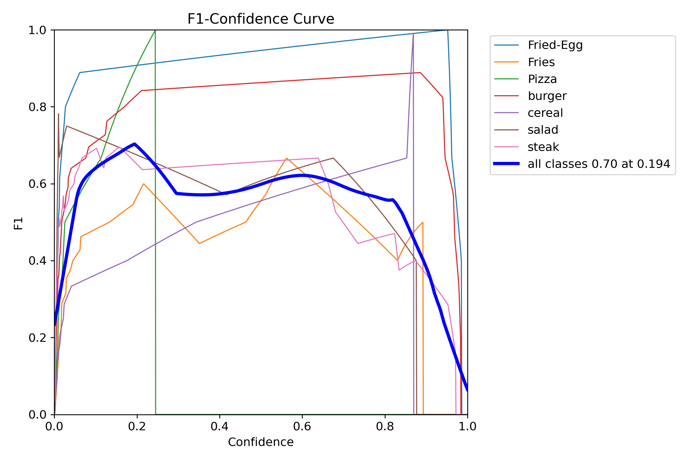
  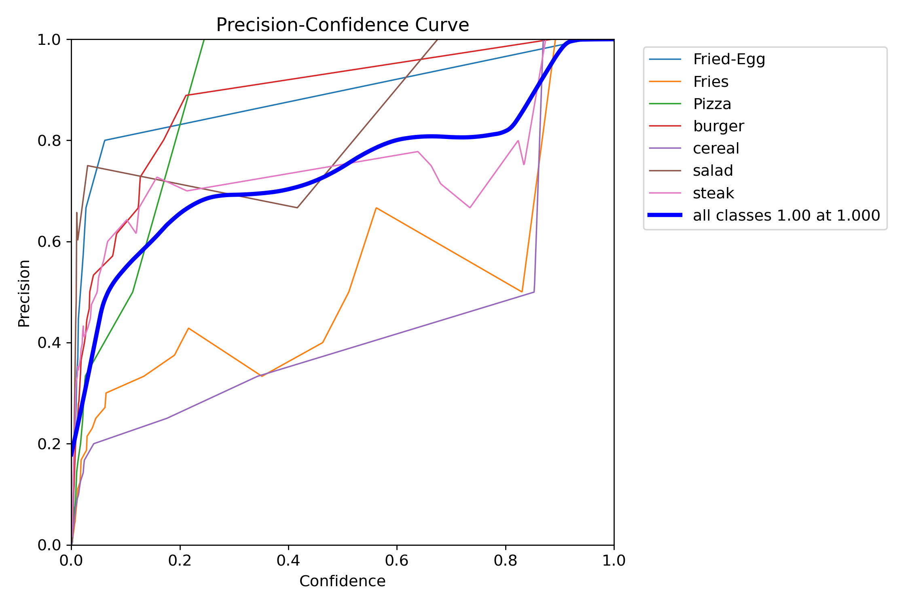

  

  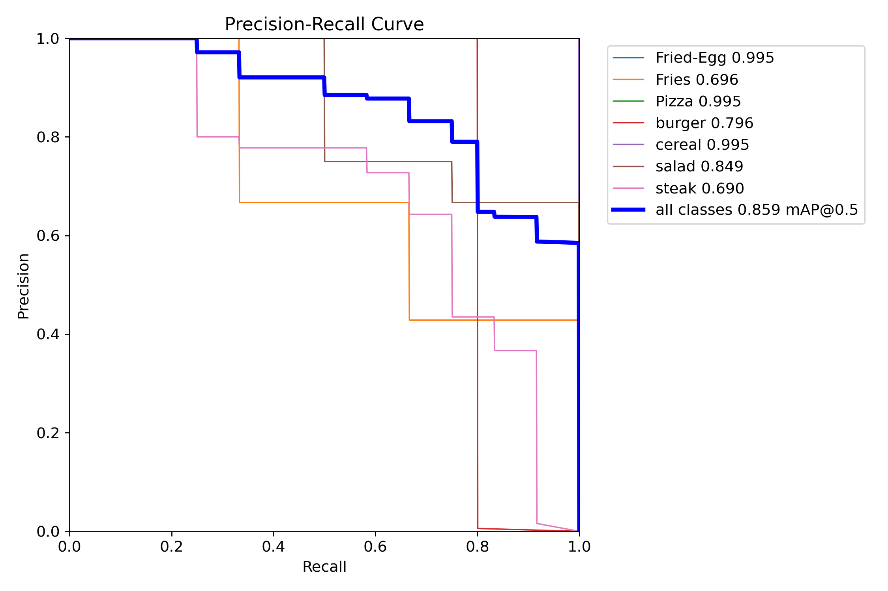
  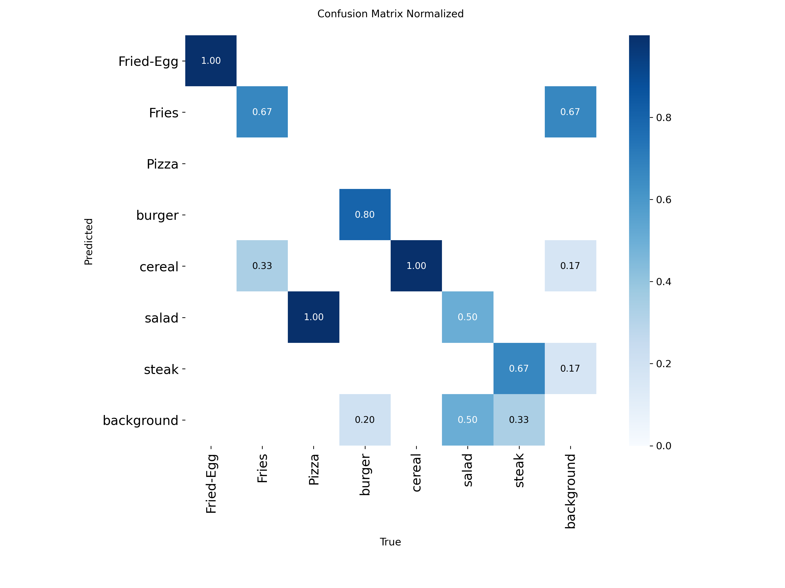

  

  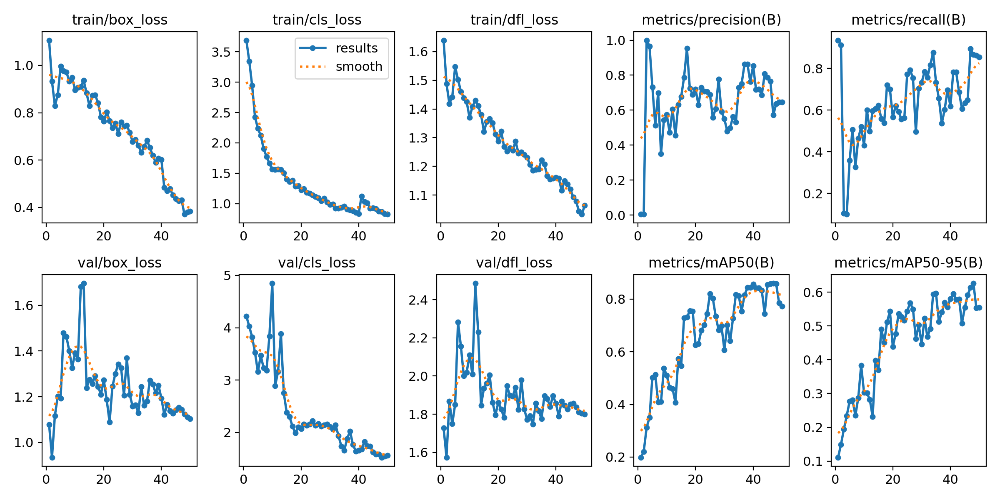

  

---

## 🖼️ Predictions with Nutrition Footer  

Each prediction includes:  
- Calories & protein per serving  
- Nutrition grade (A–D)  
- Food-specific advice (e.g., *“Add lean protein to balance this meal”*)  

### Example Outputs  

  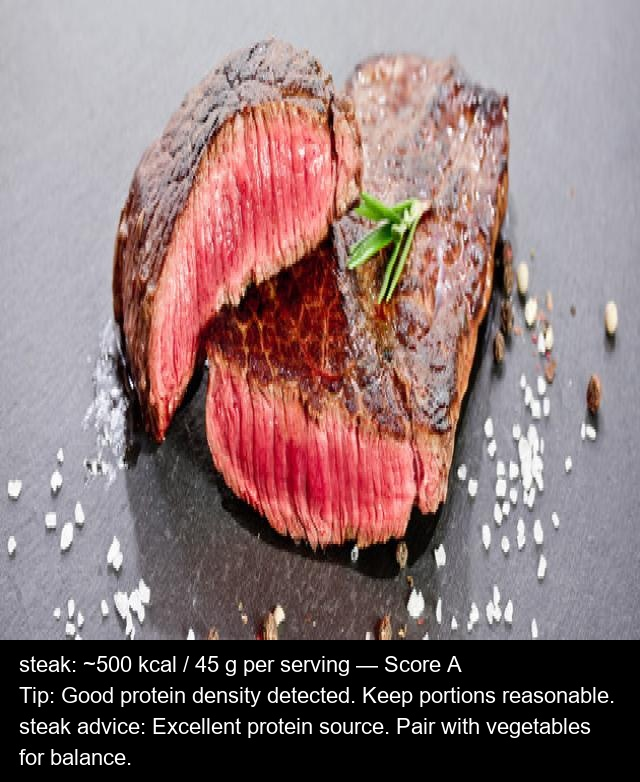
  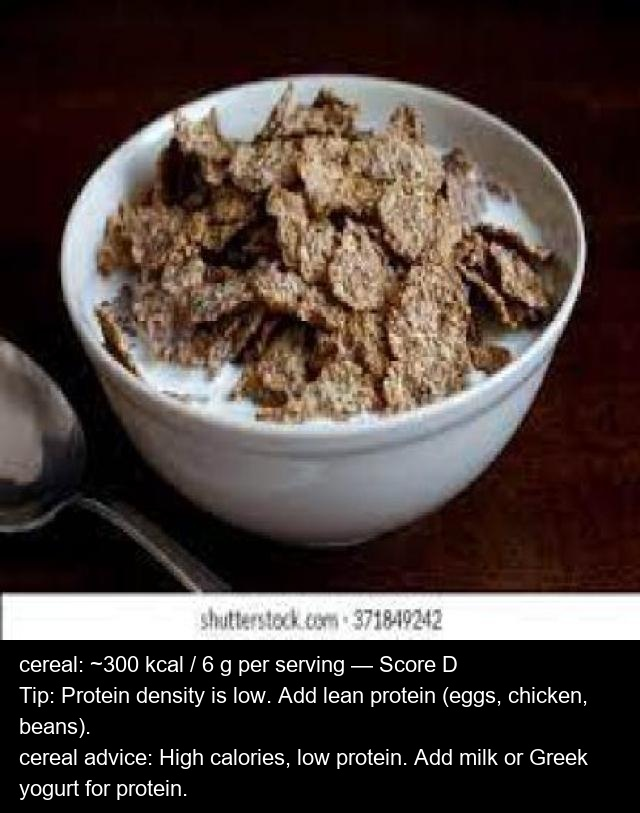

  

  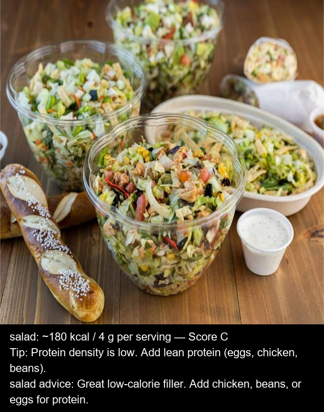
  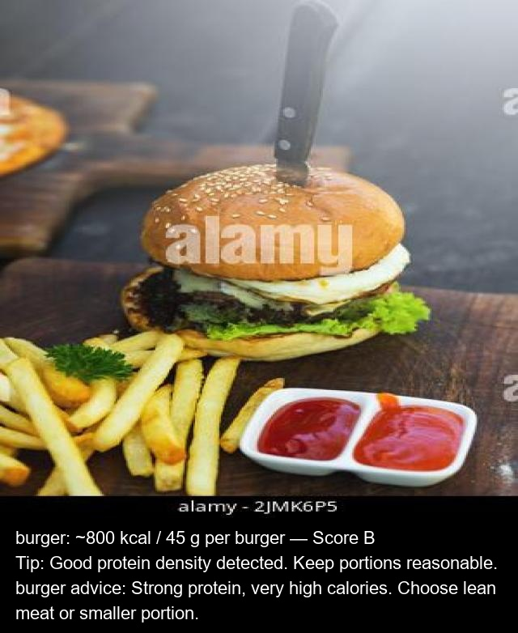

  

  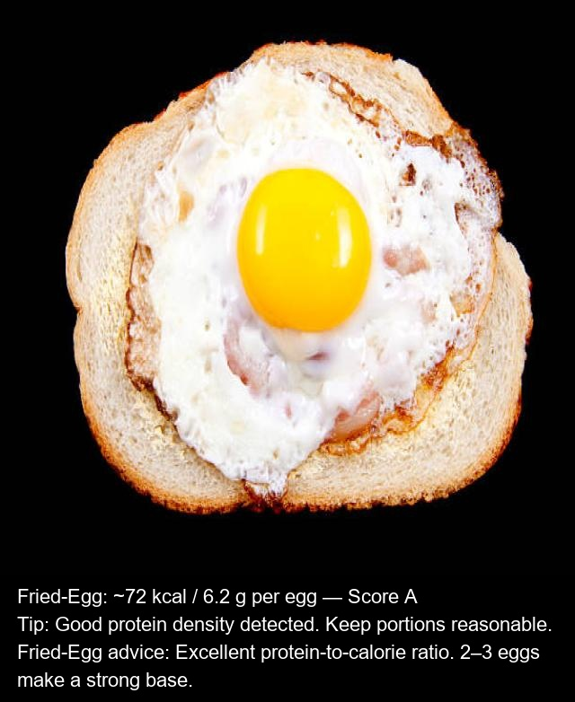
  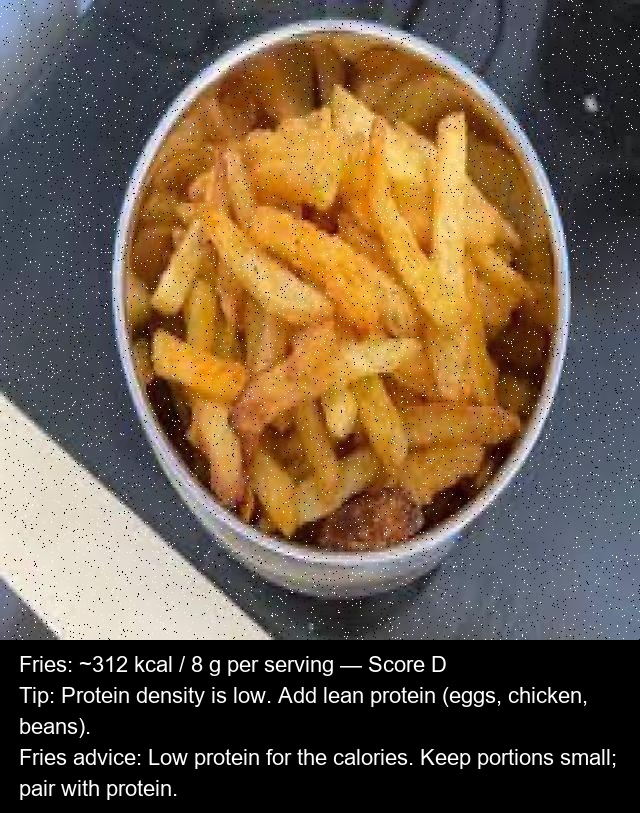

  

Code: [`src/03_predict_footer_msg.py`](src/03_predict_footer_msg.py)  

---

## 🚧 Enhancements / Next Steps  

### 1) Data & Classes  
- Expand dataset (1–2k images, balanced classes).  
- Add more foods: pasta, sandwich, rice bowls, desserts, drinks.  
- Use stronger augmentations and improve labeling quality.  

### 2) Serving-Size Estimation  
- Detect **plate/bowl** as reference object.  
- Estimate portion size from `food_area / plate_area`.  
- Scale calories & protein accordingly.  

### 3) Richer Nutrition Metrics  
- Add carbs, fat, fiber, sugar, sodium.  
- Show macro ratios (protein per kcal, % split).  
- Simple health indicators (e.g., traffic-light style).  

### 4) Modeling & Evaluation  
- Try larger YOLO models or segmentation for portion area.  
- More metrics: mAP@0.5–0.95, MAE of nutrition estimates.  
- Calibrate confidence thresholds.  

### 5) Deployment  
- Streamlit demo with image upload + live nutrition panel.  
- Option to set plate size or serving presets.  
- Overlay portion estimate on prediction image.
